# PSOC&trade; 4: MSCLP low-power multitouch mutual-capacitance touchpad 

This code example demonstrates how to use CAPSENSE&trade; middleware to detect two finger touch positions  on a mutual-capacitance-based touchpad widget in PSOC&trade; 4 devices with multi-sense converter low-power (MSCLP).

It also explains how to manually tune the mutual-capacitance-based touchpad for optimum performance according to parameters such as reliability, power consumption, response time, and linearity using the CSX-RM sensing technique and CAPSENSE&trade; Tuner GUI. Here, CAPSENSE&trade; crosspoint (CSX) represents the mutual-capacitance sensing technique and RM represents the ratiometric method.


[View this README on GitHub.](https://github.com/Infineon/mtb-example-psoc4-msclp-low-power-csx-touchpad)

[Provide feedback on this code example.](https://cypress.co1.qualtrics.com/jfe/form/SV_1NTns53sK2yiljn?Q_EED=eyJVbmlxdWUgRG9jIElkIjoiQ0UyNDA0MzEiLCJTcGVjIE51bWJlciI6IjAwMi00MDQzMSIsIkRvYyBUaXRsZSI6IlBTT0MmdHJhZGU7IDQ6IE1TQ0xQIGxvdy1wb3dlciBtdWx0aXRvdWNoIG11dHVhbC1jYXBhY2l0YW5jZSB0b3VjaHBhZCIsInJpZCI6Imx1Y2t5bCIsIkRvYyB2ZXJzaW9uIjoiMy4wLjAiLCJEb2MgTGFuZ3VhZ2UiOiJFbmdsaXNoIiwiRG9jIERpdmlzaW9uIjoiTUNEIiwiRG9jIEJVIjoiSUNXIiwiRG9jIEZhbWlseSI6IlBTT0MifQ==)


## Requirements

- [ModusToolbox&trade;](https://www.infineon.com/modustoolbox) v3.5 or later

- Board support package (BSP) minimum required version: 3.3.0
- Programming language: C
- Associated parts: [PSOC&trade; 4100T PLUS](https://www.infineon.com/002-39671)


## Supported toolchains (make variable 'TOOLCHAIN')

- GNU Arm&reg; Embedded Compiler v11.3.1 (`GCC_ARM`) – Default value of `TOOLCHAIN`
- Arm&reg; Compiler v6.22 (`ARM`)
- IAR C/C++ Compiler v9.50.2 (`IAR`)


## Supported kits (make variable 'TARGET')

- [PSOC&trade; 4100T PLUS CAPSENSE&trade; Prototyping kit](https://www.infineon.com/CY8CPROTO-041TP) (`CY8CPROTO-041TP`) – Default `TARGET`


## Hardware setup

This example uses the board's default configuration. See the kit user guide to configure the required operating voltage on the kit and to setup the VDDA supply voltage refer to section [Set up the VDDA supply voltage and debug mode in Device Configurator](#set-up-the-vdda-supply-voltage-and-debug-mode-in-device-configurator).

This application is tuned to perform optimally at the default voltage. However, you can observe the basic functionality at other supported voltages.

**Table 1. Kit user guide and supporting voltages**

   Kit | User guide  | 1.8V | 3.3V | 5V
   :-------- |:----------- |:----------- |:----- |:-----
   [CY8CPROTO-041TP](https://www.infineon.com/CY8CPROTO-041TP) | [PSOC&trade; 4100T Plus CAPSENSE&trade; Prototyping Kit guide](https://www.infineon.com/002-40273) | Yes | Yes | Yes*

Yes* - Kit default operating voltage


## Software setup

See the [ModusToolbox&trade; tools package installation guide](https://www.infineon.com/ModusToolboxInstallguide) for information about installing and configuring the tools package.

This example requires no additional software or tools.


## Using the code example

### Create the project

The ModusToolbox&trade; tools package provides the Project Creator as both a GUI tool and a command line tool.

<details><summary><b>Use Project Creator GUI</b></summary>

1. Open the Project Creator GUI tool.

   There are several ways to do this, including launching it from the dashboard or from inside the Eclipse IDE. For more details, see the [Project Creator user guide](https://www.infineon.com/ModusToolboxProjectCreator) (locally available at *{ModusToolbox&trade; install directory}/tools_{version}/project-creator/docs/project-creator.pdf*).

2. On the **Choose Board Support Package (BSP)** page, select a kit supported by this code example. See [Supported kits](#supported-kits-make-variable-target).

   > **Note:** To use this code example for a kit not listed here, you may need to update the source files. If the kit does not have the required resources, the application may not work.

3. On the **Select Application** page:

   a. Select the **Applications(s) Root Path** and the **Target IDE**.

   > **Note:** Depending on how you open the Project Creator tool, these fields may be pre-selected for you.

   b.	Select this code example from the list by enabling its check box.

   > **Note:** You can narrow the list of displayed examples by typing in the filter box.

   c. (Optional) Change the suggested **New Application Name** and **New BSP Name**.

   d. Click **Create** to complete the application creation process.

</details>

<details><summary><b>Use Project Creator CLI</b></summary>

The 'project-creator-cli' tool can be used to create applications from a CLI terminal or from within batch files or shell scripts. This tool is available in the *{ModusToolbox&trade; install directory}/tools_{version}/project-creator/* directory.

Use a CLI terminal to invoke the 'project-creator-cli' tool. On Windows, use the command-line 'modus-shell' program provided in the ModusToolbox&trade; installation instead of a standard Windows command-line application. This shell provides access to all ModusToolbox&trade; tools. You can access it by typing "modus-shell" in the search box in the Windows menu. In Linux and macOS, you can use any terminal application.

The following example clones the "CAPSENSE&trade; MSCLP mutual capacitance touchpad tuning" application with the desired name "MSCLPlowpowerMutualCapTouchpadTuning" configured for the *CY8CPROTO-041TP* BSP into the specified working directory, *C:/mtb_projects*:

   ```
   project-creator-cli --board-id CY8CPROTO-041TP --app-id mtb-example-psoc4-msclp-mutual-capacitance-touchpad --user-app-name MSCLPMutualCapTouchpadTuning --target-dir "C:/mtb_projects"
   ```

The 'project-creator-cli' tool has the following arguments:

Argument | Description | Required/optional
---------|-------------|-----------
`--board-id` | Defined in the <id> field of the [BSP](https://github.com/Infineon?q=bsp-manifest&type=&language=&sort=) manifest | Required
`--app-id`   | Defined in the <id> field of the [CE](https://github.com/Infineon?q=ce-manifest&type=&language=&sort=) manifest | Required
`--target-dir`| Specify the directory in which the application is to be created if you prefer not to use the default current working directory | Optional
`--user-app-name`| Specify the name of the application if you prefer to have a name other than the example's default name | Optional

> **Note:** The project-creator-cli tool uses the `git clone` and `make getlibs` commands to fetch the repository and import the required libraries. For details, see the "Project creator tools" section of the [ModusToolbox&trade; tools package user guide](https://www.infineon.com/ModusToolboxUserGuide) (locally available at {ModusToolbox&trade; install directory}/docs_{version}/mtb_user_guide.pdf).

</details>


### Open the project

After the project has been created, you can open it in your preferred development environment.


<details><summary><b>Eclipse IDE</b></summary>

If you opened the Project Creator tool from the included Eclipse IDE, the project will open in Eclipse automatically.

For more details, see the [Eclipse IDE for ModusToolbox&trade; user guide](https://www.infineon.com/MTBEclipseIDEUserGuide) (locally available at *{ModusToolbox&trade; install directory}/docs_{version}/mt_ide_user_guide.pdf*).

</details>


<details><summary><b>Visual Studio (VS) Code</b></summary>

Launch VS Code manually, and then open the generated *{project-name}.code-workspace* file located in the project directory.

For more details, see the [Visual Studio Code for ModusToolbox&trade; user guide](https://www.infineon.com/MTBVSCodeUserGuide) (locally available at *{ModusToolbox&trade; install directory}/docs_{version}/mt_vscode_user_guide.pdf*).

</details>


<details><summary><b>Keil µVision</b></summary>

Double-click the generated *{project-name}.cprj* file to launch the Keil µVision IDE.

For more details, see the [Keil µVision for ModusToolbox&trade; user guide](https://www.infineon.com/MTBuVisionUserGuide) (locally available at *{ModusToolbox&trade; install directory}/docs_{version}/mt_uvision_user_guide.pdf*).

</details>


<details><summary><b>IAR Embedded Workbench</b></summary>

Open IAR Embedded Workbench manually, and create a new project. Then select the generated *{project-name}.ipcf* file located in the project directory.

For more details, see the [IAR Embedded Workbench for ModusToolbox&trade; user guide](https://www.infineon.com/MTBIARUserGuide) (locally available at *{ModusToolbox&trade; install directory}/docs_{version}/mt_iar_user_guide.pdf*).

</details>


<details><summary><b>Command line</b></summary>

If you prefer to use the CLI, open the appropriate terminal, and navigate to the project directory. On Windows, use the command-line 'modus-shell' program; on Linux and macOS, you can use any terminal application. From there, you can run various `make` commands.

For more details, see the [ModusToolbox&trade; tools package user guide](https://www.infineon.com/ModusToolboxUserGuide) (locally available at *{ModusToolbox&trade; install directory}/docs_{version}/mtb_user_guide.pdf*).

</details>


## Operation

1. Connect the board to your PC using a USB cable through the KitProg3 USB connector.

2. Program the board using one of the following:

   <details><summary><b>Using Eclipse IDE</b></summary>

      1. Select the application project in the Project Explorer.

      2. In the **Quick Panel**, scroll down, and click **\<Application Name> Program (KitProg3_MiniProg4)**.
   </details>


   <details><summary><b>In other IDEs</b></summary>

   Follow the instructions in your preferred IDE.
   </details>


   <details><summary><b>Using CLI</b></summary>

     From the terminal, execute the `make program` command to build and program the application using the default toolchain to the default target. The default toolchain is specified in the application's Makefile but you can override this value manually:
      ```
      make program TARGET=<BSP> TOOLCHAIN=<toolchain>
      ```

      Example:
      ```
      make program TARGET=CY8CPROTO-041TP TOOLCHAIN=GCC_ARM
      ```
   </details>

3. After programming, the application starts automatically. 

   > **Note:** After programming, you may see the following error message if debug mode is disabled, see **Table 13** for the default debug configuration in the supported kits. This can be ignored or enabling debug solves this error.

   ``` c
   "Error: Error connecting Dp: Cannot read IDR"
   ```

4. To test the application, slide your finger over the CAPSENSE&trade; touchpad and observe the LED behavior as mentioned in Table 2, Perform gestures on the touchpad and observe the corresponding LED responses listed in Table 3.

   **Table 2. LED indications and status**

   Scenario  | CY8CPROTO-041TP |  Status
   :------------------| :-----| :-----
   Touch (Column)  | LED3 | Brightness increases when the finger is swiped from left to right
   Touch (Row) | LED2  | Brightness increases when the finger is swiped from bottom to top

   **Table 3. LED indications for gestures**

   Gesture Type  | CY8CPROTO-041TP |  Response
   :------------------| :-----| :-----
   One-finger single click  | LED5 | Turns ON for 500 ms
   One-finger double click | LED6  | Turns ON for 500 ms
   One-finger flick in up direction | LED6 | Blinks
   One-finger flick in down direction | LED5  | Blinks
   One-finger flick in left direction | LED2 | Blinks
   One-finger flick in right direction | LED3  | Blinks   
   Two-finger single click | LED5 and LED6 | Both LEDs turn ON for 500 ms     
   One-finger click & drag | LED6 | Turns ON; LED2 and LED3 indicate the drag direction   

   > **Note:** One-finger click and drag gesture is triggered when the finger movement follows this sequence: Touchdown → Lift Off → Touchdown → Drag .
   
5. Do the following to monitor the CAPSENSE&trade; data using the CAPSENSE&trade; Tuner application:

    **Monitor data using CAPSENSE&trade; Tuner**

    1. Open CAPSENSE&trade; Tuner from the **BSP Configurators** section in the IDE **Quick Panel**.

        You can also run the CAPSENSE&trade; Tuner application in standalone mode from *{ModusToolbox&trade; install directory}/ModusToolbox/tools_{version}/capsense-configurator/capsense-tuner*. In this case, after opening the application, select **File** > **Open** and open the *design.cycapsense* file of the respective application, which is present in the *{Application root directory}/bsps/TARGET_APP_\<BSP-NAME>/config/* folder.

	     See the [ModusToolbox&trade; user guide](https://www.infineon.com/ModusToolboxUserGuide) (locally available at *{ModusToolbox&trade; install directory}/docs_{version}/mtb_user_guide.pdf*) for options to start CAPSENSE&trade; Tuner using the CLI.

    2. Ensure that the kit is in CMSIS-DAP bulk mode (KitProg3 status LED is ON and not blinking). To learn how to update the firmware and switch modes in KitProg3, see [Firmware-loader](https://github.com/Infineon/Firmware-loader).

    3. In the Tuner application, click on the **Tuner Communication Setup** icon or select **Tools** > **Tuner Communication Setup**. In the window, select the **I2C** checkbox under KitProg3 and configure as follows:

       - **I2C address:** 8
       - **Sub-address:** 2 bytes
       - **Speed (kHz):** 400

        These are the same values set in the EZI2C resource.

        **Figure 2. Tuner Communication Setup parameters**

        

    4. Click **Connect** or select **Communication** > **Connect** to establish a connection.

       **Figure 3. Establish a connection**

        

    5. Click **Start** or select **Communication** > **Start** to start data streaming from the device.

         **Figure 4. Start tuner communication**

         

         The **Widget/Sensor parameters** tab gets updated with the parameters configured in the **CAPSENSE&trade; Configurator** window. The tuner displays the data from the sensor in the **Widget View** and **Graph View** tabs.

6. Set the **Read Mode** to **Synchronized**. Under the **Widget View** tab, you can see the touchpad widget sensors highlighted when you touch it.

     **Figure 5. Widget view of the CAPSENSE&trade; Tuner**

     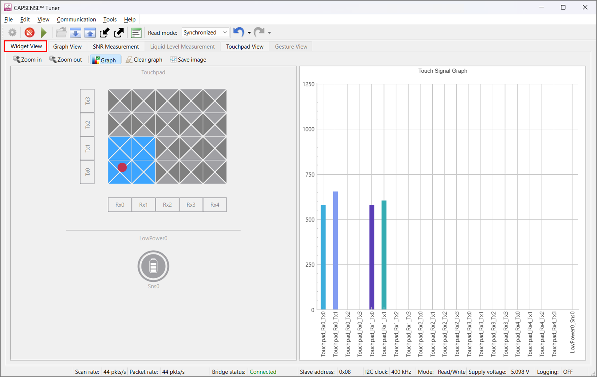

7. You can view the raw count, baseline, and difference count for each sensor and also the touchpad position in the **Graph View** tab. For example, to view the sensor data for a single sensor in Touchpad, select **Touchpad_Rx0_Tx0** under **Touchpad**.
       
   **Figure 6. Graph view of the CAPSENSE&trade; Tuner**

   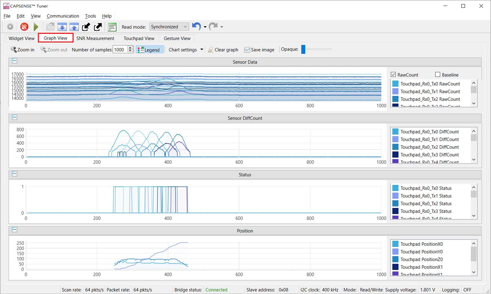

8. The **Touchpad View** tab shows the heat map view and the finger movement can be visualized on the same.

   **Figure 7. Touchpad view of the CAPSENSE&trade; Tuner**

   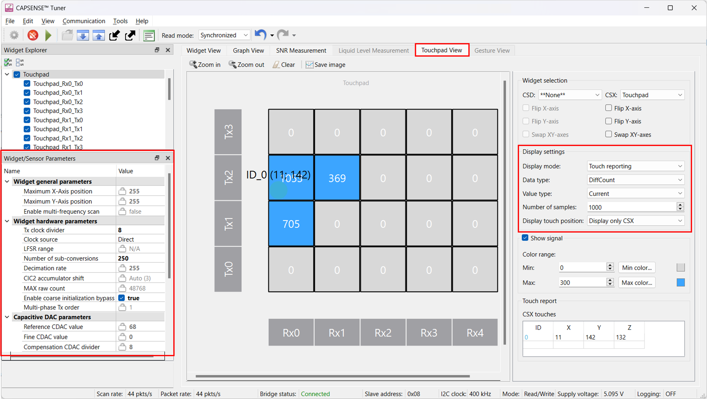

9. Observe the **Widget/Sensor parameters** section in the CAPSENSE&trade; Tuner window. The compensation CDAC values for each touchpad sensor element calculated by the CAPSENSE&trade; resource is displayed as shown in **Figure 7**.

10. Verify that the signal to noise ratio (SNR) is greater than 5:1 by following the steps given in [Stage 4](#stage-4-fine-tune-sensitivity-to-improve-snr) of the [Tuning procedure](#tuning-procedure) section.

      The linearity of the position graph, non-reporting of false touches, and no discontinuity in the line drawing indicate a proper tuning.

11. The **Gesture View** tab visually represents evaluation and tuning of gestures (from one widget at a time). The **Gesture View** tab is disabled when there are no gesture widgets in the configuration.

    **Figure 8. Gesture View of CAPSENSE&trade; Tuner**

    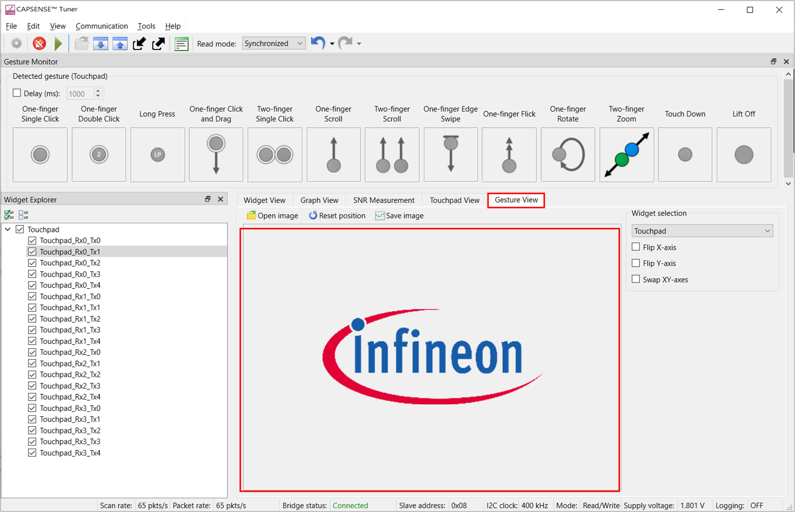
    
      > **Note:** See the "Gesture in CAPSENSE&trade;" section of [PSOC&trade; 4 and PSOC&trade; 6 MCU CAPSENSE&trade; design guide](https://www.infineon.com/AN85951) for all gesture-related configuration parameters appear after enabling gestures.

12. **Gesture Monitor** provides visual indication for a detected gesture. **Gesture Event History** logs the detected gestures information.

      > **Note:** To open the **Gesture Monitor** window, Select **View** > **Gesture Monitor/Gesture Event History**

      **Figure 9. Gesture Monitor view of CAPSENSE&trade; Tuner**

      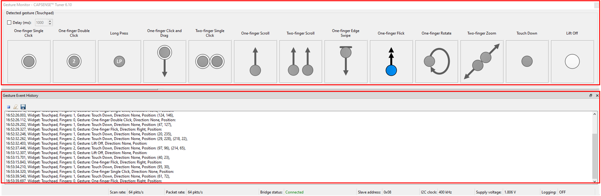

> **Note :** See the code example PSOC&trade; 4: [PSoC&trade; 4: MSCLP low-power CSD button](https://github.com/Infineon/mtb-example-psoc4-msclp-low-power-csd-button)to observe the power state transitions. Measure current at different power modes section. The code example also explains the scan time and process time measurements.

      
</details>


## Tuning procedure

<details><summary><b> Create custom BSP for your board</b></summary>

1. Create a custom BSP for your board with any device by following the steps given in [ModusToolbox&trade; BSP Assistant user guide](https://www.infineon.com/ModusToolboxBSPAssistant).

2. Open the *design.modus* file from the *{Application root directory}/bsps/TARGET_APP_\<BSP-NAME>/config/* folder obtained in the previous step and enable CAPSENSE&trade; to get the *design.cycapsense* file. CAPSENSE&trade; configuration can then be started from scratch as explained below.
</details>

The following steps explain the tuning procedure. 

> **Note:** See the "Selecting CAPSENSE&trade; hardware parameters" section of [PSOC&trade; 4 and PSOC&trade; 6 MCU CAPSENSE&trade; design guide](https://www.infineon.com/AN85951) to learn about the considerations for selecting each parameter values.

The tuning flow of the proximity widget is shown in **Figure 10**.

**Figure 10. CSX touchpad widget tuning flow**

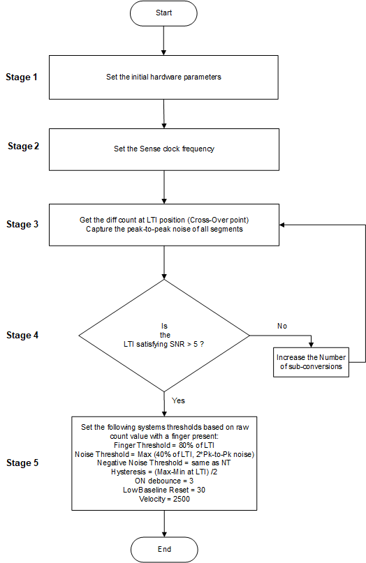

Do the following to tune the touchpad widget:

[Stage 1: Set initial hardware parameters](#stage-1-set-initial-hardware-parameters)

[Stage 2: Set the sense clock frequency](#stage-2-set-the-sense-clock-frequency)

[Stage 3: Obtain crossover point and noise](#stage-3-obtain-crossover-point-and-noise)

[Stage 4. Fine-tune sensitivity to improve SNR](#stage-4-fine-tune-sensitivity-to-improve-snr)

[Stage 5: Tune threshold parameters](#stage-5-tune-threshold-parameters)

### **Stage 1: Set initial hardware parameters**

1. Connect the board to your PC using a USB cable through the KitProg3 USB connector.
2. Launch the Device Configurator tool.

   You can launch the Device Configurator in Eclipse IDE for ModusToolbox&trade; from the **BSP Configurators** section in the IDE Quick panel or in standalone mode from *{ModusToolbox&trade; install directory}/ModusToolbox/tools_{version}/device-configurator/device-configurator*. In this case, after opening the application, select **File** > **Open** and open the *design.modus* file of the respective application, which is present in the *{Application root directory}/bsps/TARGET_APP_\<BSP-NAME>/config/* folder.

3. In the [PSOC&trade; 4100TP kit](https://www.infineon.com/CY8CPROTO-041TP), the touchpad pins are connected to CAPSENSE&trade; channel (MSCLP 0). Therefore, make sure to enable CAPSENSE&trade; channel in the **Device Configurator**, as shown in **Figure 11**.

   **Figure 11. Enable MSCLP channel in Device Configurator**

   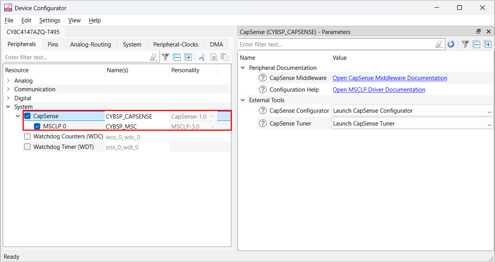

      Save the changes and close the window.

4. Launch the CAPSENSE&trade; Configurator tool.
   
   You can launch the CAPSENSE&trade; Configurator tool in Eclipse IDE for ModusToolbox&trade; from the 'CAPSENSE&trade;' peripheral setting in Device Configurator or directly from the **BSP Configurators** section in the IDE Quick panel. You can also launch it in standalone mode from *{ModusToolbox&trade; install directory}/ModusToolbox/tools_{version}/capsense-configurator/capsense-configurator*. In this case, after opening the application, select **File** > **Open** and open the *design.cycapsense* file of the respective application, which is present in the *{Application root directory}/bsps/TARGET_APP_\<BSP-NAME>/config/* folder.

   See the [ModusToolbox&trade; CAPSENSE&trade; Configurator tool guide](https://www.infineon.com/ModusToolboxCapSenseConfig) for step-by-step instructions on how to configure and launch CAPSENSE&trade; in ModusToolbox&trade;. 

5. In the **Basic** tab, note that a **Touchpad** is configured with **CSX RM (Mutual-cap)** Sensing mode.  

   **Figure 12. CAPSENSE&trade; Configurator - Basic tab**

   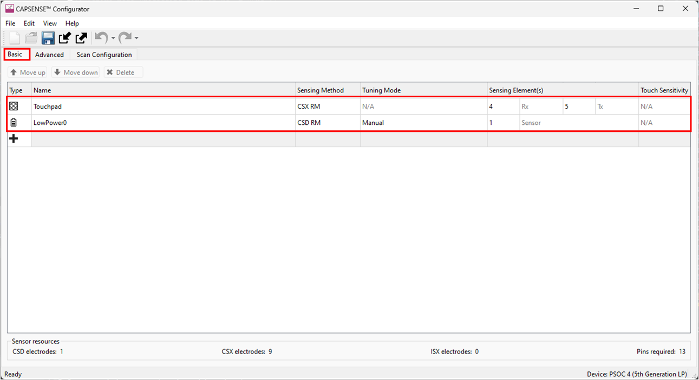

6. Go to **Advanced** > **General** tab and do the following:

   **Table 4. Widget Details**

   Parameter | Setting | Comment
   :-------- |:----------- |:-----------
   CAPSENSE&trade; IMO Clock frequency | 46 | Frequency of clock used as source for the CAPSENSE™ peripheral
   Modulator clock divider | 1 | Set to obtain the optimum modulator clock frequency
   Number of init sub-conversions | 3 | Set to ensure proper initialization of CAPSENSE™.

   > **Note:** Retain the default settings for all regular and low-power widget filters. You can enable or update the filters later depending on the signal-to-noise ratio (SNR) requirements in [Stage 3: Fine-tune for required SNR, power, and refresh rate](#stage-3-fine-tune-for-required-snr-power-and-refresh-rate).

      Filters are used to reduce the peak-to-peak noise; however, using filters will result in a higher scan time.


   **Figure 13. CAPSENSE&trade; Configurator - General settings**

   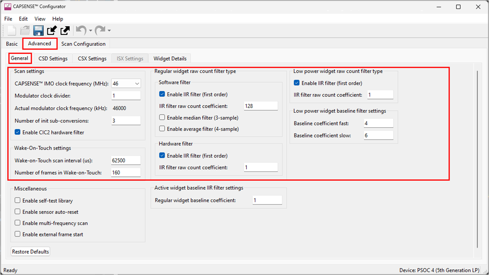

   > **Note:** Each tab has a **Restore Defaults** button to restore the parameters of that tab to their default values.

7. Go to the **CSX Settings** tab and make the following changes:

   **Table 5. Scan Setting**

   Parameter  | CY8CPROTO-041TP |Comment
   :--------  |:----------- |:-----------
   Inactive sensor connection | Ground | Connects the inactive sensors (configured sensors which are not  scanned in a given scan-slot) to the ground.
   Number of reported fingers |2 | Set for two-finger detection. 
   Raw count calibration level (%) | 40 | If the sensor raw count saturates (equals Max Raw count) on touch, reduce the Raw count calibration level (%), which helps avoid saturation.

   **Figure 14. CAPSENSE&trade; Configurator - Advanced CSX settings**

   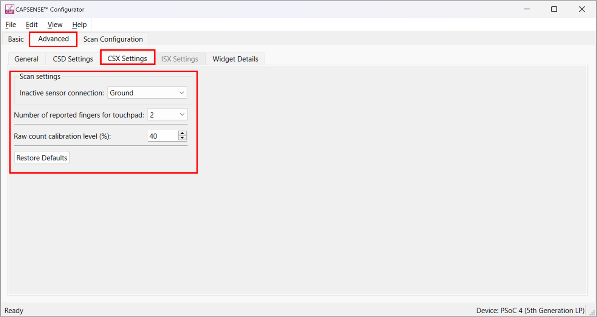

8. Go to the **Widget Details** tab. Select **Touchpad** from the left pane and set the following:

   **Table 6. Initial widget parameter Setting**

      Parameter | Setting | Comment
      :-------- |:----------- |:-----------
      Maximum X-Axis position| 255 | A touch on touchpad produces a position value from 0 to Maximum X-Axis position
      Maximum Y-Axis position | 255 | A touch on touchpad produces a position value from 0 to Maximum Y-Axis position
      Tx clock divider | Default | Value is set in [Stage 2:  Set sense clock frequency](#stage-2-set-the-sense-clock-frequency).
      Clock source | Direct | Direct clock is a constant frequency sense clock source. When you chose this option, the sensor pin switches with a constant frequency.
      Number of sub-conversions | 25 | Good starting point to ensure a fast scan time and sufficient signal. This value is adjusted as required in [Stage 3: Fine-tune for required SNR, power, and refresh rate](#stage-3-obtain-crossover-point-and-noise).
      Finger threshold | 20 | Initially set to a low value which allows the **Touchpad View** to track the finger movement during tuning.
      Noise threshold |10 |Baseline is not updated when raw count is above baseline + noise threshold.
      Negative noise threshold |10 |Baseline is not updated when raw count is below baseline - Negative noise threshold.
      Hysteresis | 5 |Prevents sensor status toggling due to system noise.
      ON debounce | 10 |Number of consecutive scans during which a sensor must be active so that a touch is reported.
      Enable gestures | True/False |Select the gestures you want to include in your application.

      These values reduce the influence of the baseline on the sensor signal, which helps get the true difference count. Retain the default values for the widget threshold parameters; these parameters are set in [**Stage 5**](#stage-5-tune-threshold-parameters).

    **Figure 15. CAPSENSE&trade; Configurator - Widget details settings**

   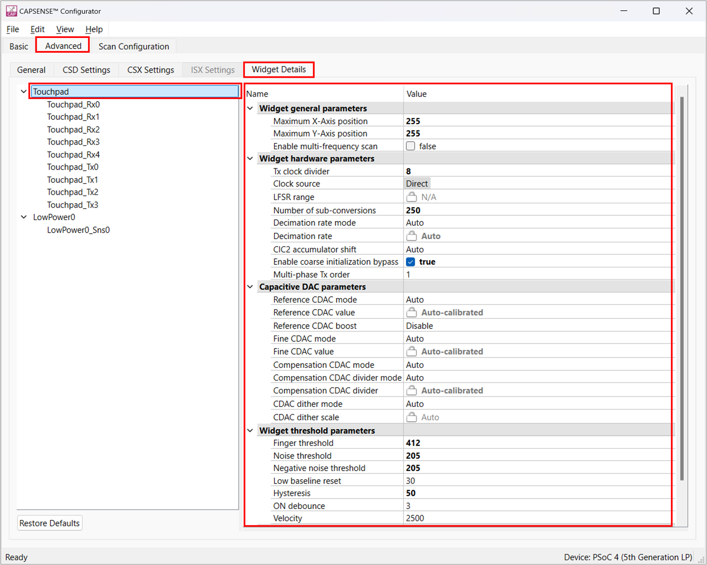

9. Go to the **Scan Configuration** tab to select the pins, the scan slots, and do the following:

   - Configure the pin for the electrode using the drop-down menu.

   - Configure the scan slot using the **Auto-Assign Slots** option or or enter a slot number for each each sensor. 

   - Check the notice list for warning or errors. 
   
   > **Note:** Enable the **Notice List** in the **View** menu if it is not visible.

   **Figure 16. Scan Configuration tab**

   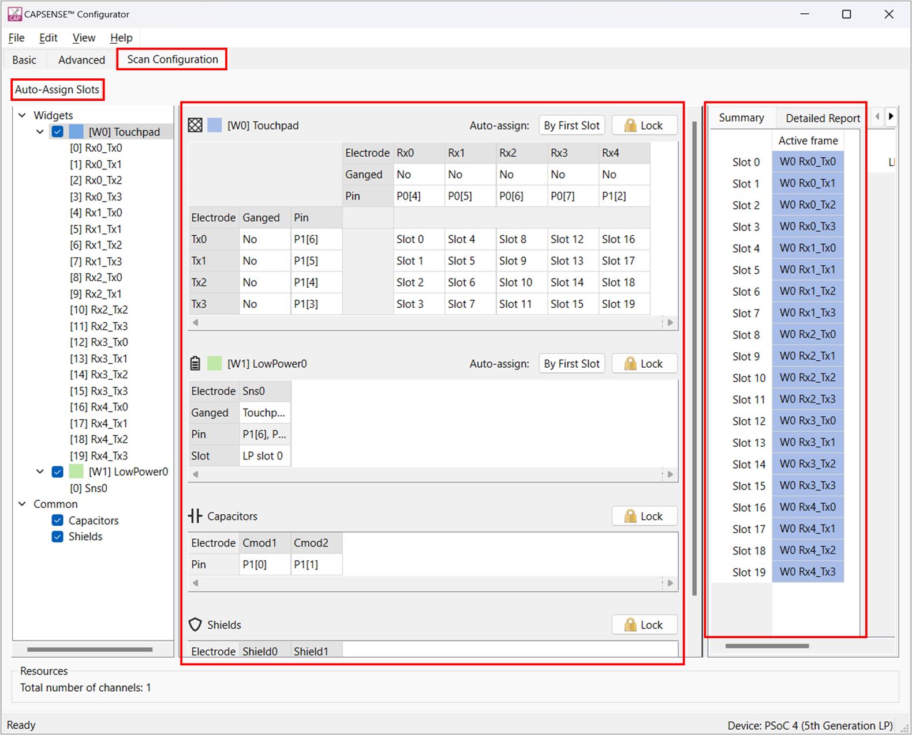

10. Click **Save** to apply the settings.


### Stage 2: Set the sense clock frequency

The sense clock is derived from the modulator clock using a sense clock divider and is used to scan the sensor by driving the CAPSENSE&trade; switched capacitor circuits. Both the clock source and clock divider are configurable. The sense clock divider should be configured in a way that the pulse width of the sense clock is long enough to let the sensor capacitance charge and discharge completely. This is verified by observing the charging and discharging waveforms of the sensor using an oscilloscope and an active probe. The sensors should be probed close to the electrode and not at the sense pins or the series resistor.

See **Figure 17** and **Figure 18** for waveforms observed on the shield. **Figure 17** shows proper charging when the sense clock frequency is correctly tuned. The pulse width is at least 5 Tau, i.e., the voltage reaches at least 99.3% of the required voltage at the end of each phase. **Figure 18** shows incomplete settling (charging/discharging).


**Figure 17. Proper charge cycle of a sensor**


**Figure 18. Improper charge cycle of a sensor**


To set the proper sense clock frequency, follow these steps:

1. Program the board and launch CAPSENSE&trade; Tuner.

2. See the charging waveform of the sensor as described earlier. 

3. If the charging is incomplete, increase the sense clock divider. This can be done in CAPSENSE&trade; Tuner by selecting the Sensor and editing the **Sense Clock Divider** parameter in the **Widget/Sensor Parameters** panel.

   > **Note:** The sense clock divider should be divisible by 2. This ensures that both the scan phases have equal durations. 

   After editing the value, click the **Apply to Device** button and observe the waveform again. Repeat this until you observe complete settling.
   
4. Click the **Apply to Project** button to save the configuration to your project. 

   **Figure 19. Sense Clock Divider setting**

   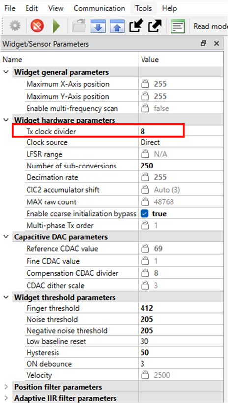
   

5. Repeat this process for all the sensors and the shield. Each sensor may require a different sense clock divider value to charge/discharge completely. But all the sensors that are in the same scan slot need to have the same sense clock source, sense clock divider, and number of sub-conversions. Therefore, take the largest sense clock divider in a given scan slot and apply it to all the other sensors that share that slot.

**Table 7. Sense clock divider settings obtained for supported kits**

   Parameter |CY8CPROTO-041TP
   :-------- |:----------- 
   Sense clock divider | 16

### Stage 3: Obtain crossover point and noise

1. Program the board.

2. Launch the CAPSENSE&trade; Tuner to monitor the CAPSENSE&trade; data and for CAPSENSE&trade; parameter tuning and SNR measurement.

   See the [CAPSENSE&trade; Tuner guide](https://www.infineon.com/ModusToolboxCapSenseTuner) for step-by-step instructions on how to launch and configure the CAPSENSE&trade; Tuner in ModusToolbox&trade; software.
     
3. Capture the raw counts of each sensor element in the touchpad (as shown in **Figure 20**) and verify that they are approximately (± 5%) equal to 40% of the MaxCount. See the [design guide](https://www.infineon.com/AN85951) for the MaxCount equation.

   1. Go to the **Touchpad View** tab and change the **Display settings** as shown:

      **Table 8. Display settings**

      Parameter | Setting | 
      :-------- |:----------- 
      Display mode | Touch reporting 
      Data type | RawCount
      Value type| Current
      Number of samples | 1000

    **Figure 20. Raw counts obtained on the Touchpad View tab of the Tuner window**

     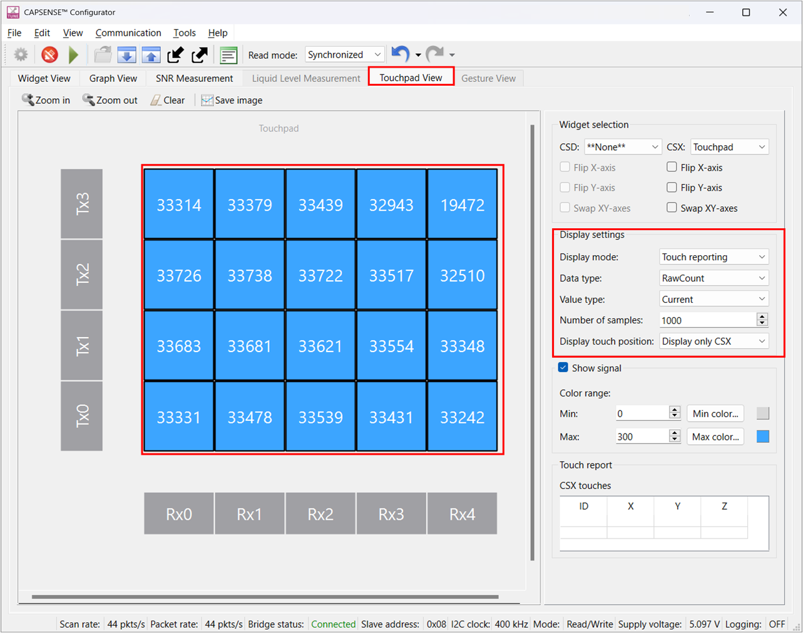

4. Capture and note the peak-to-peak noise of each sensor element in the touchpad.

   1. From the **Widget Explorer** section, select the  **Touchpad** widget.

   2. Go to the **Touchpad View** tab and change the **Display settings** as shown:

      **Table 9. Display settings**

         Parameter | Setting | 
         :-------- |:----------- 
         Display mode | Touch reporting 
         Data type | RawCount
         Value type| Max-Min
         Number of samples | 1000

      Capture the variation in the raw counts for 1000 samples, without placing a finger (which gives the peak-to-peak noise) and note the highest noise.

     **Figure 21. Noise obtained on the Touchpad View tab of the Tuner window**

      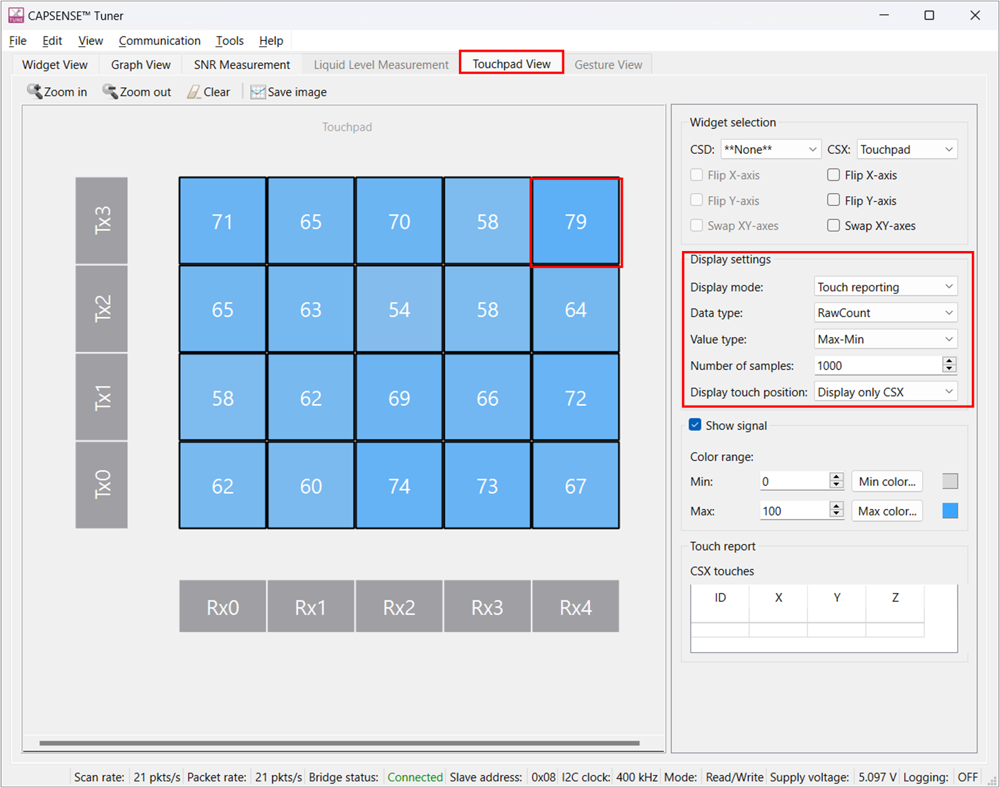

      **Table 10. Max peak-to-peak noise obtained in supported kits**

      Kit | Max peak-to-peak noise
      :----------|:-------------------------
      CY8CPROTO-041TP   | 130

      <br>

7. A finger (6 mm) should be held on the touchpad in the least touch intensity (LTI) position (at the intersection of four nodes) as shown in **Figure 22**.

   **Figure 22. Least touch intensity (LTI) position**

   

   > **Note:** Finger movement during the test can artificially increase the noise level.

   1. Go to the **Touchpad View** tab and change the **Display settings** as follows:

      - **Display mode:** Touch Reporting

      - **Data type:** DiffCount

      - **Value type:** Current

   2. Place the finger in a way that you obtain an almost equal signal in all four intersecting nodes (look at the heat map displayed in the **Touchpad View** tab as shown in **Figure 23**).

      > **Note:** The LTI signal is measured at the farthest point of the touchpad from the sensor pin connection, where the sensors have the worst-case RC-time constant.

     **Figure 23. LTI position in Touchpad View**

      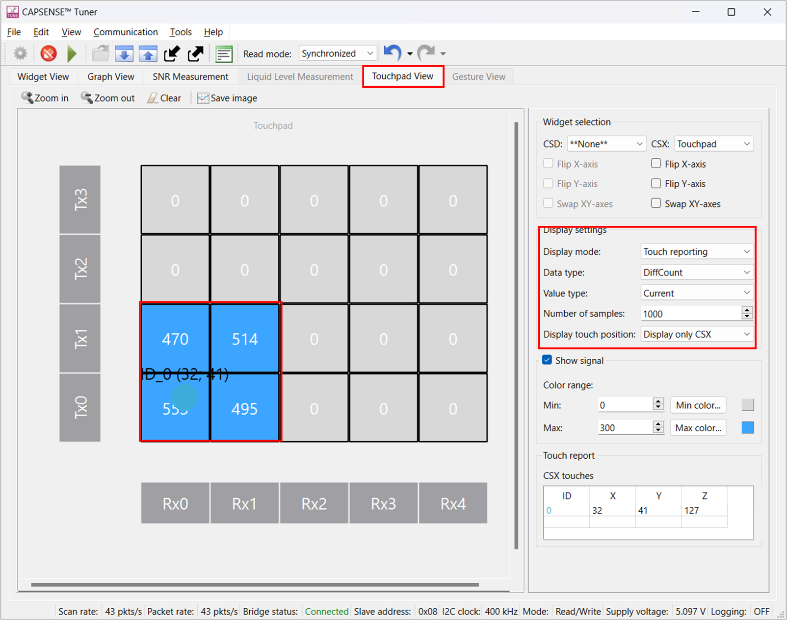

      as shown in Figure 23 LTI Signal = (470 + 514 + 495 + 559)/4 = 510 

      **Table 11. LTI signal obtained in supported kits**

      Kit | LTI signal
      :----------|:-------------------------
      CY8CPROTO-041TP   |850


### Stage 4. Fine-tune sensitivity to improve SNR

The CAPSENSE&trade; system may be required to work reliably in adverse conditions, such as a noisy environment. The touchpad sensors should be tuned with SNR > 5:1 to avoid triggering false touches and to make sure that all intended touches are registered in these adverse conditions.

> **Note:** For gesture detection, it is recommended to have approximately 10:1 SNR.

1. Ensure that the LTI Signal count is greater than 50 and meets at least 5:1 SNR (using **Equation 1**).

   In the **CAPSENSE&trade; Tuner** window, increase the **Number of sub-conversions** (located in the **Widget/Sensor Parameters** section, under **Widget Hardware Parameters**) by 10 until you achieve this requirement.

   **Equation 1: Measuring the SNR**

   

   Where,

   - LTI signal is the signal obtained as mentioned in **Table 11** for supported kits.

   - Pk-Pk noise is the peak-to-peak noise obtained as shown in **Table 10** for supported kits.

   SNR is measured using **Equation 1**.

   Here, from **Table 11** and **Table 10**,

   SNR = 850/130 = 6.5

   > **Note:** Ensure that the **Number of sub-conversions** (Nsub) does not exceed the max limit and saturate the raw count.

2. Update the number of sub-conversions

   - Update the **number of sub-conversions** directly in the **Widget/Sensor parameters** tab of the CAPSENSE&trade; Tuner.

   - PSOC&trade; 4 CAPSENSE&trade; devices with MSCLP have a built-in CIC2 filter. Enabling the CIC2 filter increases the resolution while maintaining the same scan time. see [AN234231 - PSoC™ 4 CAPSENSE™ ultra-low-power capacitive sensing techniques](https://www.infineon.com/AN234231) for detailed information on CIC2 filter.

   - Current consumption is directly proportional to **number of sub-conversions**. Therefore, decrease the **number of sub-conversions** to achieve lower current consumption.

     > **Note:** Number of sub-conversions should be greater than or equal to 8.


3. After changing the **Number of sub-conversions**, click **Apply to Device** to send the setting to the device. The change is reflected in the graphs.

  > **Note:** The **Apply to Device** option is enabled only when the **Number of sub-conversions** is changed.

4. If the SNR condition is not achieved even with the maximum number of sub-conversions, enable filters in the **General** settings (go to the **Advanced** tab of the CAPSENSE&trade; Configurator). This is generally not required for this kit.


### Stage 5: Tune threshold parameters

After confirming that your design meets the timing parameters and power requirements and the SNR is greater than 5:1, set your threshold parameters.

> **Note:** Thresholds are set based on the LTI position, because it is the least valid touch signal that can be obtained.

For measuring the **Hysteresis**, do the following:

1. Place the finger in the LTI position.

2. Set the **Data type** to **DiffCount** and **Value type** to **Max-Min** in the **Touchpad View** tab and click **Clear**.

3. Record the MAXIMUM of all four max-min count values (Max_Min_count) of the selected 2x2 sensors.


   **Figure 24. Obtaining the hysteresis**

   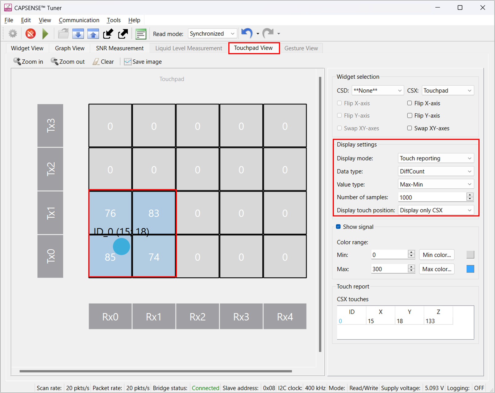

4. Hysteresis = Max_Min_count/2 = 85/2 = 43

Set the recommended threshold values for the **Touchpad** widget using the LTI signal value obtained in [**Stage 4**](#stage-4-fine-tune-sensitivity-to-improve-snr):

   **Table 12. Software tuning parameters obtained for supported kits** 

   Parameter  | CY8CPROTO-041TP  |  Remark
   :---------------------| :-----| :-----|
   Number of sub-conversions	| 100|-
   Finger threshold |  680 |80% of the lower LTI signal  |
   Noise threshold  | 340 | Twice the highest noise or 40% of the lower LTI signal (whichever is greater) |
   Negative noise threshold | 340 | Twice the highest noise or 40% of the lower LTI signal (whichever is greater) |
   Hysteresis  | 50 | 10% of the lower LTI signal  |
   Low baseline reset  | 30 | 30 (by default) | 
   ON debounce	| 3 |Default
   Velocity  |2500  | (Default) The 'Velocity' parameter is not required for single finger detection

   > **Note:** For multiple finger detection, if the velocity value is low, two touches at different positions are considered to be two different finger touches. On the other hand, if it is set at a higher value, it is considered to be the same finger moving to a different position.

<br>

#### Apply settings to firmware

1. Click **Apply to Device** and **Apply to Project** in the **CAPSENSE&trade; Tuner** window to apply the settings to the device and project, respectively. 

2. Close the tuner.

   **Figure 26. Apply to Project**

   

<br>

## Debugging

You can debug this project to step through the code. In the IDE, use the **\<Application Name> Debug (KitProg3_MiniProg4)** configuration in the **Quick Panel**. For details, see the "Program and debug" section in the [Eclipse IDE for ModusToolbox&trade; user guide](https://www.infineon.com/MTBEclipseIDEUserGuide).

To enable the debug option, see the [Setup VDDA and Debug mode](#set-up-the-vdda-supply-voltage-and-debug-mode-in-device-configurator) section. To achieve lower power consumption, it is recommended to disable it when not debugging.

see, **Table 13** for the default debug configuration in the supported kits,

**Table 13. Debug mode option status**

   Kit  | Debug mode 
   :----| :----------
   CY8CPROTO-041TP | Enabled


## Design and implementation

The project contains a touchpad widget configured in CSX-RM Sensing mode. See the [Tuning procedure](#tuning-procedure) section for step-by-step instructions to configure the other settings of the **CAPSENSE&trade; Configurator**.

The project uses the [CAPSENSE&trade; middleware](https://github.com/Infineon/capsense) (see ModusToolbox&trade; user guide for more details on selecting a middleware). See [AN85951 – PSOC&trade; 4 and PSOC&trade; 6 MCU CAPSENSE&trade; design guide](https://www.infineon.com/AN85951) for more details on CAPSENSE&trade; features and usage.

The [ModusToolbox&trade;](https://www.infineon.com/modustoolbox) provides a GUI-based Tuner application for debugging and tuning the CAPSENSE&trade; system. The CAPSENSE&trade; Tuner application works with EZI2C and UART communication interfaces. This project has an SCB block configured in EZI2C mode to establish communication with the onboard KitProg, which in turn enables reading the CAPSENSE&trade; raw data by the CAPSENSE&trade; Tuner (see **Figure 29**).

The CAPSENSE&trade; data structure that contains the CAPSENSE&trade; raw data is exposed to the CAPSENSE&trade; Tuner by setting up the I2C communication data buffer with the CAPSENSE&trade; data structure. This enables the tuner to access the CAPSENSE&trade; raw data for tuning and debugging CAPSENSE&trade;.

The successful tuning of the touchpad is indicated by the user LED in the prototyping kit. The LED2 brightness increases when the finger is moved from bottom to top and LED3 brightness increases when the finger is moved from left to right on the touchpad.

### Set up the VDDA supply voltage and debug mode in Device Configurator

1. Open **Device Configurator** from the Quick panel. 

2. Go to the **Systems** tab, select the **Power** resource, and set the **VDDA** value under **Operating Conditions** as shown in **Figure 28**.

  **Figure 27. Setting the VDDA supply in the system tab of Device Configurator**

   

3. By default, see **Table 13** for the default debug configuration in the supported kits. Enable the debug mode to enable the SWD pins, as shown in **Figure 28**:

   **Figure 28. Enable Debug mode in the System tab of Device Configurator**

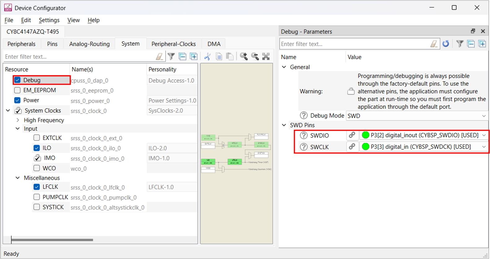

### Resources and settings

See the [Operation](#operation) section for step-by-step instructions to configure CAPSENSE&trade; Configurator.

**Figure 29. Device Configurator - EZI2C peripheral parameters**

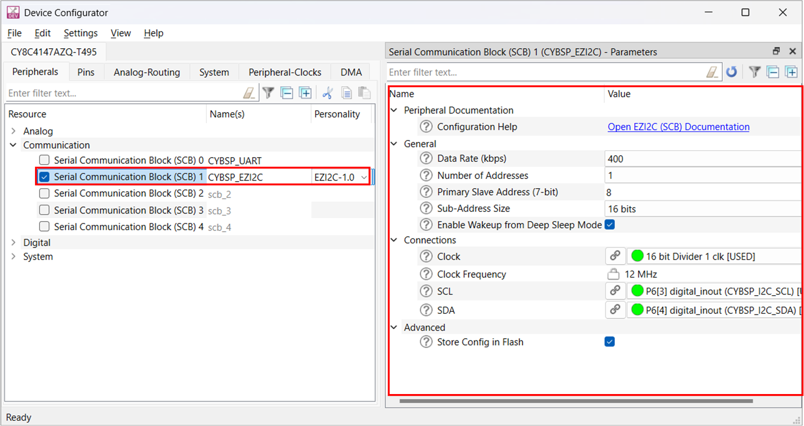

**Figure 30. PWM settings**

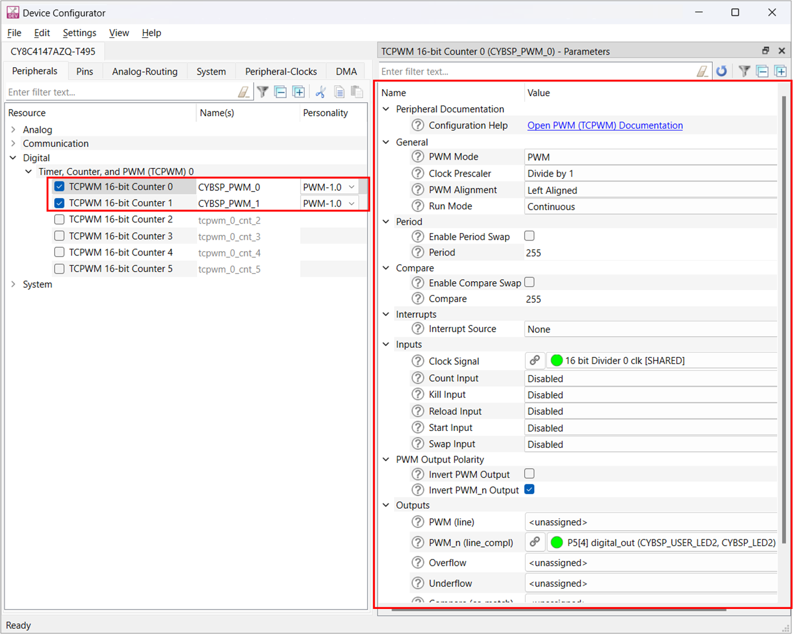

**Table 14. Application resources**

 Resource  |  Alias/object     |    Purpose
 :-------- | :-------------    | :------------
 SCB (I2C) (PDL) | CYBSP_EZI2C          | EZI2C slave driver to communicate with CAPSENSE&trade; Tuner GUI 
 CAPSENSE&trade; | CYBSP_MSCLP0 | CAPSENSE&trade; driver to interact with the MSCLP hardware and interface the CAPSENSE&trade; sensors 
 Digital pin | CYBSP_USER_LED1, CYBSP_USER_LED2, CYBSP_USER_LED3, CYBSP_USER_LED4 | To visualise the touchpad response and gestures
 PWM | CYBSP_PWM | To drive the user LED which visualizes touchpad response

<br>

### Firmware flow

**Figure 31. Firmware flowchart**

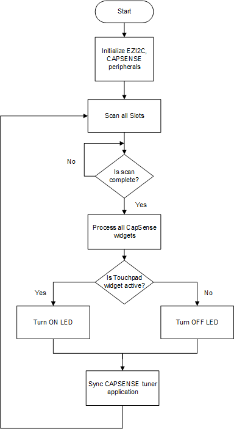

## Related resources

Resources  | Links
-----------|----------------------------------
Application notes  | [AN79953](https://www.infineon.com/AN79953) – Getting started with PSOC&trade; 4 <br> [AN85951](https://www.infineon.com/AN85951) – PSOC&trade; 4 and PSOC&trade; 6 MCU CAPSENSE&trade; design guide <br> [AN234231](https://www.infineon.com/AN234231) - PSoC™ 4 CAPSENSE™ ultra-low-power capacitive sensing techniques
Code examples  | [Using ModusToolbox&trade;](https://github.com/Infineon/Code-Examples-for-ModusToolbox-Software) on GitHub <br> [Using PSOC&trade; Creator](https://www.infineon.com/cms/en/design-support/software/code-examples/psoc-3-4-5-code-examples-for-psoc-creator)
Device documentation | [PSOC&trade; 4 datasheets](https://www.infineon.com/cms/en/search.html?intc=searchkwr-return#!view=downloads&term=psoc%204&doc_group=Data%20Sheet) <br>[PSOC&trade; 4 technical reference manuals](https://www.infineon.com/cms/en/search.html#!term=psoc%204%20technical%20reference%20manual&view=all)
Development kits | Select your kits from the [Evaluation board finder](https://www.infineon.com/cms/en/design-support/finder-selection-tools/product-finder/evaluation-board).
Libraries on GitHub  | [mtb-pdl-cat2](https://github.com/Infineon/mtb-pdl-cat2) – PSOC&trade; 4 Peripheral Driver Library (PDL)
Middleware on GitHub  | [capsense](https://github.com/Infineon/capsense) – CAPSENSE&trade; library and documents
Tools  | [ModusToolbox&trade;](https://www.infineon.com/modustoolbox) – ModusToolbox&trade; software is a collection of easy-to-use libraries and tools enabling rapid development with Infineon MCUs for applications ranging from wireless and cloud-connected systems, edge AI/ML, embedded sense and control, to wired USB connectivity using PSOC&trade; Industrial/IoT MCUs, AIROC&trade; Wi-Fi and Bluetooth&reg; connectivity devices, XMC&trade; Industrial MCUs, and EZ-USB&trade;/EZ-PD&trade; wired connectivity controllers. ModusToolbox&trade; incorporates a comprehensive set of BSPs, HAL, libraries, configuration tools, and provides support for industry-standard IDEs to fast-track your embedded application development. <br> [PSOC&trade; Creator](https://www.infineon.com/cms/en/design-support/tools/sdk/psoc-software/psoc-creator/) – IDE for PSOC&trade; and FM0+ MCU development

<br>


## Other resources

Infineon provides a wealth of data at [www.infineon.com](https://www.infineon.com) to help you select the right device, and quickly and effectively integrate it into your design.

The Bluetooth&reg; word mark and logos are registered trademarks owned by Bluetooth SIG, Inc., and any use of such marks by Infineon is under license.


## Document history

Document title: *CE240431* – *PSOC&trade; 4: MSCLP low power CSX touchpad*

 Version | Description of change
 ------- | ---------------------
 1.0.0   | New code example <br> This version is not backward compatible with ModusToolbox&trade; v3.1
 2.0.0   | Major update to support ModusToolbox&trade; v3.3. This version is not backward compatible with previous versions of ModusToolbox&trade;
 3.0.0   | Major update to support ModusToolbox&trade; v3.5. This version is not backward compatible with previous versions of ModusToolbox&trade; 
<br>


All referenced product or service names and trademarks are the property of their respective owners.

The Bluetooth&reg; word mark and logos are registered trademarks owned by Bluetooth SIG, Inc., and any use of such marks by Infineon is under license.


---------------------------------------------------------

© Cypress Semiconductor Corporation, 2022-2024. This document is the property of Cypress Semiconductor Corporation, an Infineon Technologies company, and its affiliates ("Cypress").  This document, including any software or firmware included or referenced in this document ("Software"), is owned by Cypress under the intellectual property laws and treaties of the United States and other countries worldwide.  Cypress reserves all rights under such laws and treaties and does not, except as specifically stated in this paragraph, grant any license under its patents, copyrights, trademarks, or other intellectual property rights.  If the Software is not accompanied by a license agreement and you do not otherwise have a written agreement with Cypress governing the use of the Software, then Cypress hereby grants you a personal, non-exclusive, nontransferable license (without the right to sublicense) (1) under its copyright rights in the Software (a) for Software provided in source code form, to modify and reproduce the Software solely for use with Cypress hardware products, only internally within your organization, and (b) to distribute the Software in binary code form externally to end users (either directly or indirectly through resellers and distributors), solely for use on Cypress hardware product units, and (2) under those claims of Cypress’s patents that are infringed by the Software (as provided by Cypress, unmodified) to make, use, distribute, and import the Software solely for use with Cypress hardware products.  Any other use, reproduction, modification, translation, or compilation of the Software is prohibited.
<br>
TO THE EXTENT PERMITTED BY APPLICABLE LAW, CYPRESS MAKES NO WARRANTY OF ANY KIND, EXPRESS OR IMPLIED, WITH REGARD TO THIS DOCUMENT OR ANY SOFTWARE OR ACCOMPANYING HARDWARE, INCLUDING, BUT NOT LIMITED TO, THE IMPLIED WARRANTIES OF MERCHANTABILITY AND FITNESS FOR A PARTICULAR PURPOSE.  No computing device can be absolutely secure.  Therefore, despite security measures implemented in Cypress hardware or software products, Cypress shall have no liability arising out of any security breach, such as unauthorized access to or use of a Cypress product. CYPRESS DOES NOT REPRESENT, WARRANT, OR GUARANTEE THAT CYPRESS PRODUCTS, OR SYSTEMS CREATED USING CYPRESS PRODUCTS, WILL BE FREE FROM CORRUPTION, ATTACK, VIRUSES, INTERFERENCE, HACKING, DATA LOSS OR THEFT, OR OTHER SECURITY INTRUSION (collectively, "Security Breach").  Cypress disclaims any liability relating to any Security Breach, and you shall and hereby do release Cypress from any claim, damage, or other liability arising from any Security Breach.  In addition, the products described in these materials may contain design defects or errors known as errata which may cause the product to deviate from published specifications. To the extent permitted by applicable law, Cypress reserves the right to make changes to this document without further notice. Cypress does not assume any liability arising out of the application or use of any product or circuit described in this document. Any information provided in this document, including any sample design information or programming code, is provided only for reference purposes.  It is the responsibility of the user of this document to properly design, program, and test the functionality and safety of any application made of this information and any resulting product.  "High-Risk Device" means any device or system whose failure could cause personal injury, death, or property damage.  Examples of High-Risk Devices are weapons, nuclear installations, surgical implants, and other medical devices.  "Critical Component" means any component of a High-Risk Device whose failure to perform can be reasonably expected to cause, directly or indirectly, the failure of the High-Risk Device, or to affect its safety or effectiveness.  Cypress is not liable, in whole or in part, and you shall and hereby do release Cypress from any claim, damage, or other liability arising from any use of a Cypress product as a Critical Component in a High-Risk Device. You shall indemnify and hold Cypress, including its affiliates, and its directors, officers, employees, agents, distributors, and assigns harmless from and against all claims, costs, damages, and expenses, arising out of any claim, including claims for product liability, personal injury or death, or property damage arising from any use of a Cypress product as a Critical Component in a High-Risk Device. Cypress products are not intended or authorized for use as a Critical Component in any High-Risk Device except to the limited extent that (i) Cypress's published data sheet for the product explicitly states Cypress has qualified the product for use in a specific High-Risk Device, or (ii) Cypress has given you advance written authorization to use the product as a Critical Component in the specific High-Risk Device and you have signed a separate indemnification agreement.
<br>
Cypress, the Cypress logo, and combinations thereof, ModusToolbox, PSoC, CAPSENSE, EZ-USB, F-RAM, and TRAVEO are trademarks or registered trademarks of Cypress or a subsidiary of Cypress in the United States or in other countries. For a more complete list of Cypress trademarks, visit www.infineon.com. Other names and brands may be claimed as property of their respective owners.
